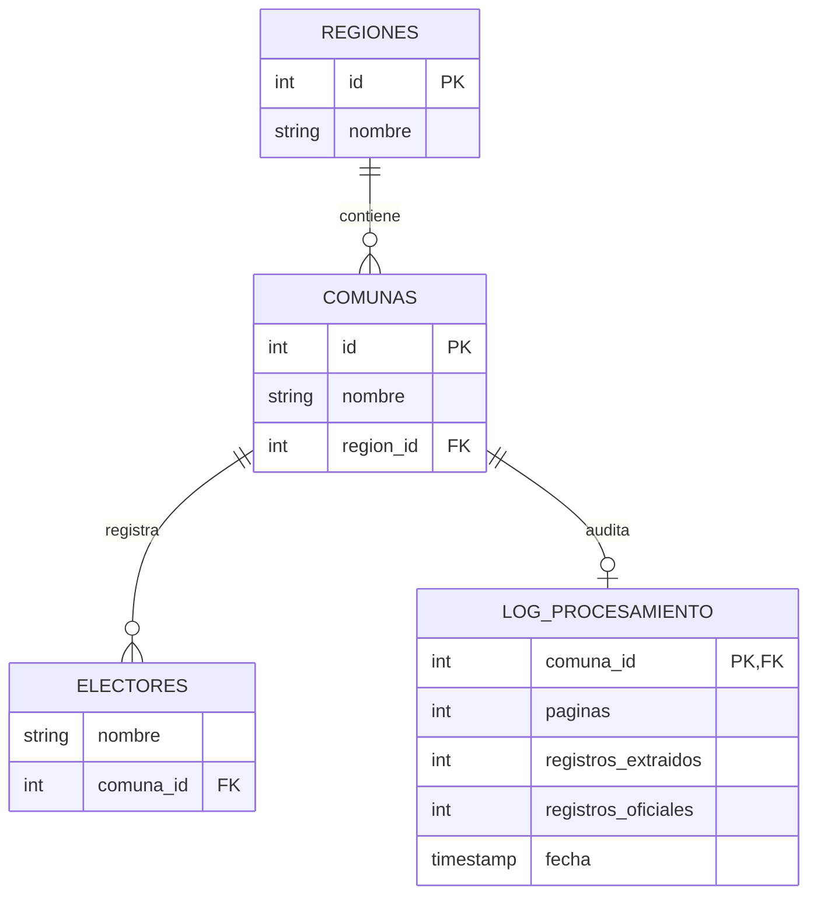
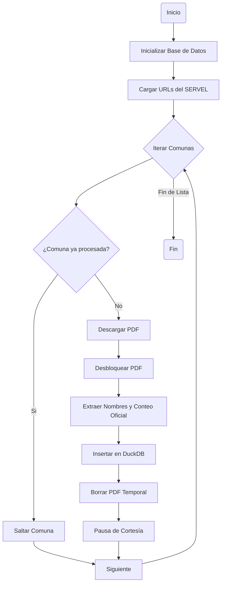

# 🗳️ X-Check Chile 2025

Este proyecto automatiza la descarga, desbloqueo y extracción de datos del **Padrón Electoral Definitivo 2025** de Chile, consolidando la información de los 15 millones de electores en una base de datos relacional de alto rendimiento.

## 📋 Tabla de Contenidos
- [Características](#características)
- [Arquitectura de Datos](#arquitectura-de-datos)
- [Diagrama de Flujo](#diagrama-de-flujo)
- [Estructura del Proyecto](#estructura-del-proyecto)
- [Instalación](#instalación)
- [Uso](#uso)
- [Robustez y Validación](#robustez-y-validación)
- [Librerías Principales](#librerías-principales)
- [Licencia](#licencia)

## ✨ Características
- **Scraping Automático:** Obtiene los enlaces de descarga de las 346 comunas desde el portal del SERVEL.
- **Desbloqueo Quirúrgico:** Elimina restricciones de copia de los PDFs mediante `pikepdf`.
- **Extracción Espacial:** Captura nombres de electores usando coordenadas específicas y filtros de color para máxima pureza.
- **Base de Datos DuckDB:** Almacenamiento columnar optimizado para consultas analíticas sobre millones de registros.
- **Sistema de Auditoría:** Compara el número de registros extraídos contra el "Conteo Oficial" declarado en el encabezado del PDF.

## 📊 Arquitectura de Datos
El proyecto utiliza un modelo relacional de 3 tablas para garantizar integridad y ahorro de espacio:



## ⚙️ Diagrama de Flujo (Pipeline)
El orquestador procesa cada comuna de forma secuencial para minimizar el uso de recursos:



## 📂 Estructura del Proyecto
```text
/mega-get-download-url
├── data/
│   ├── raw/                # HTML fuente del SERVEL y otros insumos
│   ├── processed/          # Base de datos (.db) y CSV de URLs
│   └── temp/               # Almacenamiento temporal de PDFs (auto-limpiable)
├── docs/                   # Documentación adicional (metodología)
├── reports/                # Reportes generados sobre la base de datos
├── src/
│   ├── extraction/         # Módulos de orquestación y extracción
│   │   ├── scraper.py      # Fase 1: Extracción de URLs desde HTML
│   │   ├── extractor.py    # Fase 2: Lógica de desbloqueo y PyMuPDF
│   │   ├── database.py     # Fase 3: Gestión de esquema DuckDB
│   │   ├── pipeline.py     # Fase 4: Orquestador masivo con checkpoints
│   │   └── generate_report.py # Reportes detallados de salud de la DB
│   └── db_shell.py         # Consola interactiva SQL
├── environment.yml         # Configuración del ambiente Conda
├── GEMINI.md               # Contexto específico para el asistente Gemini
└── README.md
```

## 🚀 Instalación
1.  **Configurar entorno:**
    ```bash
    conda env create -f environment.yml
    conda activate padron-2025
    ```
2.  **Preparar fuente:**
    Coloca el archivo HTML del SERVEL en `data/raw/source.html`.

## 💻 Uso
1.  **Generar lista de comunas:**
    ```bash
    python src/extraction/scraper.py
    ```
2.  **Iniciar carga masiva:**
    ```bash
    python src/extraction/pipeline.py
    ```
3.  **Consultar datos:**
    ```bash
    python src/db_shell.py
    ```
4.  **Generar reporte de salud:**
    ```bash
    python src/extraction/generate_report.py
    ```

## 🛡️ Robustez y Validación
- **Checkpoints:** El script detecta si una comuna ya fue cargada y la salta automáticamente, permitiendo reanudar el proceso tras cualquier interrupción.
- **Atomicidad:** La inserción en la base de datos se realiza solo si la extracción completa del PDF fue exitosa. No se guardan datos parciales.
- **Double-Check:** Validación en tiempo real del total de registros extraídos contra el total declarado en la esquina superior derecha del PDF original `(Rect: 45, 50, 50, 105)`.

## 🛠️ Librerías Principales
- **[PyMuPDF (fitz)](https://pymupdf.readthedocs.io/):** Extracción de texto por coordenadas y color.
- **[pikepdf](https://pikepdf.readthedocs.io/):** Desbloqueo de restricciones de seguridad en PDFs.
- **[DuckDB](https://duckdb.org/):** Motor de base de datos analítica integrada.
- **[Pandas](https://pandas.pydata.org/):** Manipulación de datos y gestión de URLs.

## Licencia:

> El proyecto está licenciado bajo licencia privativa

---
Hecho con 🦾 por Diego Prokes Herbage
